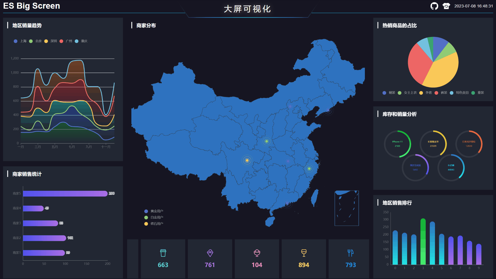
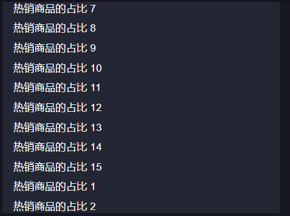

# es-big-screen 大屏可视化项目模板


这是一个基于Vue 3、Echarts、高德地图和Pinia开发的大屏可视化项目，提供了拖拽布局、大屏适配、图表组件(Echarts)封装以及地图组件等功能的封装。

[源码地址](https://github.com/vangleer/es-big-screen)

[在线示例](https://vangleer.github.io/es-big-screen)

## 大屏开发第二弹

上一篇文章分享了大屏适配、图表组件(Echarts)封装、拖拽布局以及地图组件等功能的封装

[高效开发大屏可视化项目：公共组件封装指南](https://juejin.cn/post/7248242431659966522)

今天主要分享大屏入场动画和无缝滚动相关功能的实现

## 入场动画

- 最终效果



主要使用了CSS动画

### Header 动画

`src/views/screen/components/Header.vue` 一个简单的淡入动画

```css
.es-screen-header {
	animation: fade 3s;
}
@keyframes fade {
	from {
		opacity: 0;
	}
	to {
		opacity: 1;
	}
}
```

### Left 左侧动画

`src/views/screen/components/left/index.vue`

```css
.es-screen-left-item {
	/* ... */
	&:nth-child(1) {
		height: 550px;
		animation-duration: .8s; // 新增
	}
	&:nth-child(2) {
		animation-duration: 1.5s; // 新增
	}
}
@keyframes slide {
  0% {
    transform: translateX(-100%);
  }
  80% {
    transform: translateX(20px);
  }
  100% {
    transform: translateX(0);
  }
}
```

左侧定义一个滑入动画，从左侧-100%进入到20px最后回到0原来的位置，这样定义会有一个弹的效果

### Right 右侧动画

`src/views/screen/components/right/index.vue`

```css
.es-screen-right-item {
	/* ... */
	animation-name: slide;
	&:nth-child(1) {
		animation-duration: 0.5s; // 新增
	}
	&:nth-child(2) {
		animation-duration: 1s; // 新增
	}
	&:nth-child(3) {
		animation-duration: 1.5s; // 新增
	}
}

@keyframes slide {
  0% {
    transform: translateX(100%);
  }
  80% {
    transform: translateX(-20px);
  }
  100% {
    transform: translateX(0);
  }
}
```

与左侧类似，只是方向变了

### Center 中间地图入场动画

`src/views/screen/components/center/index.vue`

```css
.es-center {
	animation: slideAndFade 1.5s; // 新增
}

@keyframes slideAndFade {
  0% {
    transform: translateY(218px);
		opacity: 0;
  }
  100% {
    transform: translateX(0);
		opacity: 1;
  }
}
```

从下往上移动，移动的同时淡入显示

## 无缝滚动封装

无缝滚动在大屏可视化项目中非常常见，本小节使用animejs实现了一个支持横纵无缝滚动的自定义钩子

先安装一下 animejs 的依赖

```
yarn add animejs
```

直接上代码

```typescript
import { onMounted, shallowRef, Ref } from 'vue'
import anime from 'animejs/lib/anime.es.js'

export type OptionsType = {
	direction?: 'horizontal' | 'vertical'
	gap?: number
	duration?: number
}

export function useSeamlessScroll(listRef: Ref<HTMLElement | null>, options: OptionsType = {}) {
	const {
		direction = 'horizontal',
		gap = 10,
		duration = 10000
	} = options
	const animation = shallowRef<ReturnType<typeof anime>>(null)

	function init() {
		const isHorizontal = direction === 'horizontal'

		const translateKey = isHorizontal ? 'translateX' : 'translateY'

		const transKey = isHorizontal ? 'x' : 'y'

		// items
		const children = listRef.value?.children || []
		if (!children.length) return

		// 第一个元素
		const firstEl =  children[0] as HTMLElement
		const firstDiff = (isHorizontal ? firstEl.offsetWidth : firstEl.offsetHeight ) + gap

		// 默认将list元素向左或向上移动一个item的距离
		listRef.value!.style.transform = `${translateKey}(-${firstDiff}px)`

		const transList: any = []
		let total = 0 // 总宽/高
		// 设置初始位置
		anime.set(children, {
			[translateKey]: (el: HTMLElement, i) => {

				const distance = (isHorizontal ? el.offsetWidth : el.offsetHeight ) + gap
				total += distance

				const diff = (i - 1) * distance
				transList[i] = { [transKey]: diff }
				return diff
			}
		})
		// 设置list容器的宽或高
		listRef.value!.style[isHorizontal ? 'width' : 'height'] = total + 'px'

		// 添加动画
		animation.value = anime({
			targets: transList,
			duration,
			easing: 'linear',
			direction: isHorizontal ? undefined : 'reverse',
			[transKey]: `+=${total}`,
			loop: true,
			update: () => {
				anime.set(children, {
					[translateKey]: (el, i) => {
						return transList[i][transKey] % total
					}
				})
			}
		})
	}
	// 暂停
	function pause() {
		animation.value!.pause()
	}
	// 停止
	function play() {
		animation.value!.play()
	}

	onMounted(() => {
		init()
	})

	return {
		listRef,
		pause,
		play,
		animation
	}
}

```

`useSeamlessScroll` 接受两个参数：`listRef` 和 `options`。`listRef` 是一个 `Ref` 对象，用于引用滚动列表的 DOM 元素。`options` 是一个配置对象，可以设置滚动的方向、间隙和持续时间。

步骤解析：

1. 根据传入的滚动方向，确定 `translateKey` 和 `transKey`，`translateKey` 表示 CSS 中的移动方向，`transKey` 表示animejs中的x/y轴方向。

2. 获取滚动列表的子元素，并计算第一个元素的偏移量。因为默认从从第二个元素开始，这样初始移动是才不会出现空白

3. 初始化滚动列表的位置，将其向左（横向滚动）或向上（纵向滚动）移动一个元素的距离。

4. 遍历子元素，计算每个元素的偏移量，并将其设置为初始位置。

5. 根据滚动方向，设置滚动列表容器的宽度或高度。

6. 使用 `animejs` 库实现无缝滚动效果，在动画更新时，根据计算出的偏移量更新子元素的位置

### 使用 `useSeamlessScroll`


```html
<template>
	<div class="es-center-bottom">
		<div ref="listRef" class="es-bottom-list">
			<div v-for="item in 10" class="es-bottom-item">
				{{ item }}
			</div>
		</div>
	</div>
</template>

<script setup lang='ts'>
import { ref } from 'vue'
import { useSeamlessScroll } from '@/utils/useSeamlessScroll'

const listRef = ref()
useSeamlessScroll(listRef)
</script>

<style lang='scss' scoped>
.es-center-bottom {
	position: relative;
	width: 100%;
	overflow: hidden;
	height: 150px;
	.es-bottom-item {
		position: absolute;
		top: 0;
		left: 0;
		width: 170px;
		height: 150px;
		display: flex;
    flex-direction: column;
    justify-content: center;
    align-items: center;
		background-color: var(--es-block-bg);
		font-size: 22px;
    font-weight: 600;
		.es-item-text {
      margin-top: 16px;
    }
	}
}
</style>

```
可以看到用了两层包裹列表，最外面一层的作用是防止溢出，第二层才是偏移的列表元素


## 抽离成组件简化使用方式

新建 src/components/SeamlessScroll.vue

```html
<template>
	<div class="es-seamless-scroll">
		<div ref="listRef" class="es-seamless-scroll-list">
			<slot />
		</div>
	</div>
</template>

<script setup lang='ts'>
import { useSeamlessScroll, OptionsType } from '@/utils/useSeamlessScroll'
import { PropType, ref } from 'vue'

const props = defineProps({
	width: {
		type: [String, Number]
	},
	height: {
		type: [String, Number]
	},
	option: {
		type: Object as PropType<OptionsType>,
		default: () => ({})
	}
})
const listRef = ref()
useSeamlessScroll(listRef, props.option)

</script>

<style lang='scss' scoped>
.es-seamless-scroll {
	overflow: hidden;
	width: 100%;
	height: 100%;
}
</style>

```

使用组件

```html
<template>
	<SeamlessScroll class="es-center-bottom">
		<div v-for="item in 10" class="es-bottom-item">
			{{ item }}
		</div>
	</SeamlessScroll>
</template>

<script setup lang='ts'>
import SeamlessScroll from '@/components/SeamlessScroll.vue'
</script>

<style lang='scss' scoped>
.es-center-bottom {
	position: relative;
	width: 100%;
	overflow: hidden;
	height: 150px;
	.es-bottom-item {
		position: absolute;
		top: 0;
		left: 0;
		width: 170px;
		height: 150px;
		display: flex;
    flex-direction: column;
    justify-content: center;
    align-items: center;
		background-color: var(--es-block-bg);
		font-size: 22px;
    font-weight: 600;
		.es-item-text {
      margin-top: 16px;
    }
	}
}
</style>

```

效果和直接使用钩子一样，不过组件使用起来还是要简单一点

- 组件默认是横向滚动，如果想纵向滚动传入direction为vertical即可

```html
<template>
	<SeamlessScroll class="es-list" :option="{ direction: 'vertical' }">
		<div v-for="item in 15" class="es-item">{{ '热销商品的占比 ' + item }}</div>
	</SeamlessScroll>
</template>

<script setup lang='ts'>
import SeamlessScroll from '@/components/SeamlessScroll.vue'

</script>

<style lang='scss' scoped>
.es-list {
	position: relative;
	width: 100%;
	height: 100%;
	overflow: hidden;
	.es-item {
		position: absolute;
		height: 20px;
	}
}
</style>

```



## 最后

本文介绍了入场动画和无缝滚动方面的实现，你可以根据示例代码进行实践和定制

如果你对该项目模板感兴趣，可以通过源码地址和在线示例链接来获取更多信息，并进行进一步的学习和应用
